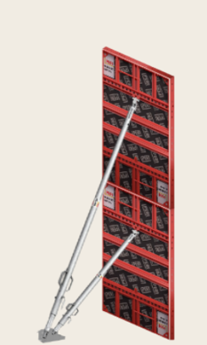
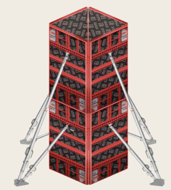
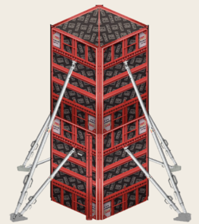
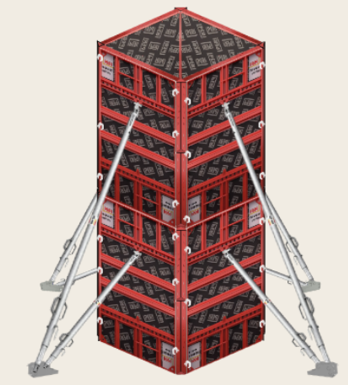

### Procedure

#### Step 1: Construct one side of a column: Installing the form panel, placing the brace kicker & erecting the push props as shown in the picture below. 

  

#### Step 2: Similarly connect remaining sides of the column: Left, Back & Right side as shown in the picture below. 

  

#### Step 3: Attach external corner to connect all the sides of the column: Left, Back, Right & Front Corner. 

  

#### Step 4: Add Wedge pin to connect panel and corner rigidly: Left wedge pins, right wedge pins & front wedge pins as shown in the picture below. 

  

#### Step 5: Inspect and ready for concrete 

