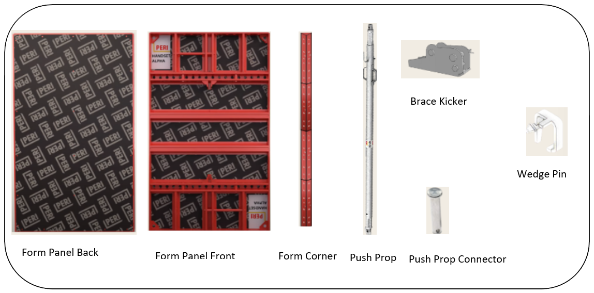

### Theory

#### Apparatus / Materials / Components: 
Form panel, Form Corner, Push Prop, Brace Kicker, Wedge Pin.

PERI formwork systems offer efficient and customizable solutions for constructing concrete columns with precise dimensions. The modular design allows for flexibility in adapting to various project requirements. Heavy-duty towers and bracing systems provide robust structural support, ensuring accurate alignment and stability. Aluminium and timber beams are strategically positioned to support the formwork panels, creating a stable mould for concrete. This approach facilitates easy adjustments and promotes uniform curing, contributing to the overall quality of the finished columns. By utilizing PERI's engineered solutions, contractors can streamline the formwork process, reduce the risk of defects, and enhance the overall structural integrity of their projects

##### Detailed study of the components involved: 

#### 1.  Form Panel: 
A "form panel" in the PERI column formwork system is a flat panel used to mould the shape of concrete columns during construction. Form panels serve the following purpose. 

- Shaping: Defines the exact dimensions and shape of the concrete column. 
- Support: Holds wet concrete in place until it sets. 
- Finish: Provides a smooth surface for a clean column finish. 
- Modularity: Allows for easy assembly, adjustment, and reuse. 
- Durability: Withstands the pressure of curing concrete, ensuring structural integrity. 

#### 2.  Form Corner: 
A "form corner" in the PERI column formwork system is a specialized component used to create and support the corners of concrete columns. Form Corner serves the following purpose. 

- Corner Shaping: Defines and maintains the precise corner angles of the column. 
- Support: Provides structural stability and reinforcement at the corners. 
- Alignment: Ensures accurate positioning and alignment of the formwork panels. 
- Durability: Withstands the pressure of the concrete, preventing deformation and ensuring a clean corner finish. 

#### 3. Push Prop: 
Push props" in the PERI column formwork system are adjustable vertical supports used to stabilize and align formwork components. Push Props serves the following purpose. 

- Stabilization: Provides additional support to keep formwork panels securely in place. 
- Alignment: Helps maintain precise vertical alignment of formwork elements during setup. 
- Adjustability: Allows for fine-tuning of formwork positions to ensure correct dimensions and stability. 
- Load Distribution: Assists in distributing the load from the concrete evenly, preventing formwork failure. 

#### 4. Brace Kicker: 
A "brace kicker" in the PERI column formwork system is a diagonal support used to reinforce the formwork structure. Brace Kickers serves the following purpose. 

- Stability: Provides diagonal bracing to prevent formwork panels from shifting or collapsing. 
- Alignment: Ensures that the formwork remains in the correct position during concrete pouring. 
- Load Transfer: Helps transfer loads from the formwork to the supporting structure, maintaining formwork integrity. 

#### 5. Wedge Pin: 
A "wedge pin" in the PERI column formwork system is a fastening component used to secure and adjust formwork panels and other elements. Wedge Pins serves the following purpose. 

- Secure Fastening: Locks formwork panels and components in place to prevent movement. 
- Adjustment: Allows for precise alignment and adjustments of formwork positions. 
- Stability: Enhances the overall stability of the formwork system during concrete pouring and curing. 

  
Components in Column PERI
 

